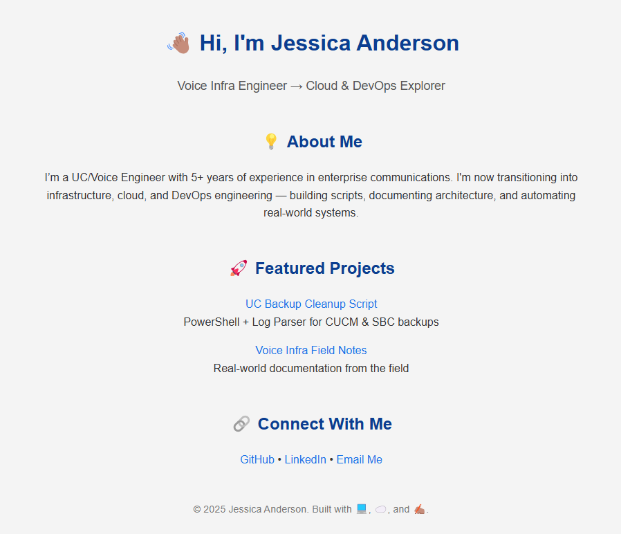

# 💼 Jessica Anderson - Portfolio

Welcome to the source code for my personal portfolio site!  
This site is built to showcase my professional journey in Unified Communications, Infrastructure, DevOps, and Cloud technologies.

🌐 **Visit the Live Site**  
👉 [https://jesmanderson-portfolio.s3.amazonaws.com/index.html](https://jesmanderson-portfolio.s3.amazonaws.com/index.html)  
(Hosted via AWS S3 + GitHub Actions CI/CD)

---

## 🛠️ Tech Stack

- HTML5 + CSS3
- GitHub Pages for repo hosting
- AWS S3 (Static Website Hosting)
- GitHub Actions (automated deployment workflow)

---

## 📷 Preview

 <!-- optional -->

---

## 🚀 Deployment

This site is automatically deployed via GitHub Actions to AWS S3 on every `main` branch update.  
You can view the full CI/CD config in `.github/workflows/deploy.yml`.

---

## 📬 Contact

Feel free to reach out:

- 📧 jesmanderson@gmail.com  
- 💼 [LinkedIn](https://www.linkedin.com/in/jessica-anderson-84b423211/)  

---

## 📜 License

MIT - feel free to fork, remix, or build your own version.
